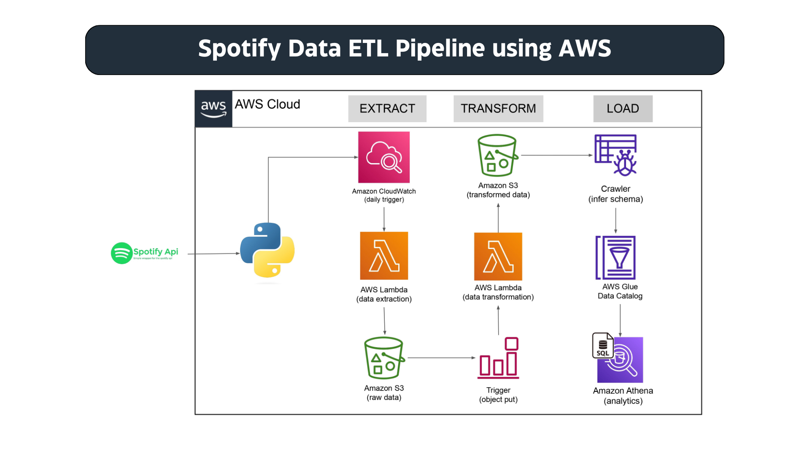

<div align="center">

<h1>🎵 Spotify Data ETL Pipeline using AWS</h1>

<p><b>Serverless ETL pipeline that extracts Spotify playlist data, processes it with AWS Lambda, stores raw files in Amazon S3, and prepares analytics-ready datasets.</b></p>

<p>


</p>

</div>

---

## 📌 Project Overview

This project demonstrates an end-to-end serverless ETL pipeline using the Spotify Web API and AWS services. Playlist data is extracted through the Spotify API, transformed using AWS Lambda functions, stored in Amazon S3, and made available for analytics.

---

## 🎯 Objectives

- Extract Spotify playlist metadata
- Automate ETL with AWS Lambda
- Store raw and transformed data in Amazon S3
- Build a serverless data engineering workflow
- Demonstrate cloud-native ETL concepts

---

## 🔄 Pipeline Workflow

```text
Spotify API
    │
    ▼
AWS Lambda (Extract)
    │
    ▼
Amazon S3 (Raw)
    │
    ▼
AWS Lambda (Transform)
    │
    ▼
Amazon S3 (Processed)
```

---

## 📁 Project Structure

```text
Spotify-Data-ETL-Pipeline-using-AWS/
├── Architecture-diagram.png
├── lambda1-code.py
├── lambda2-code.py
├── script.ipynb
├── api-keys.txt
├── README.md
├── LICENSE
└── .gitignore
```

---

## 🖼️ Architecture

<p align="center">

</p>

---

## 🚀 Getting Started

```bash
git clone https://github.com/CodeByMan/Spotify-Data-ETL-Pipeline-using-AWS.git
cd Spotify-Data-ETL-Pipeline-using-AWS
```

Configure Spotify API credentials, deploy the Lambda functions, configure S3 buckets, and trigger the ETL workflow.

> **Important:** Do not commit real Spotify API credentials. Replace any values in `api-keys.txt` with placeholders before pushing to GitHub.

---

## 🛠️ Technologies Used

| Technology | Purpose |
|---|---|
| Python | ETL logic |
| Spotify Web API | Data source |
| AWS Lambda | Serverless compute |
| Amazon S3 | Data lake storage |
| Jupyter Notebook | Development and testing |

---

## 👤 Author

**Muhammad Ali Nawaz**  
Cloud Data Engineer

---

## 📄 License

This project is licensed under the MIT License.

---

<p align="center"><b>⭐ If you found this project useful, consider giving it a star!</b></p>
